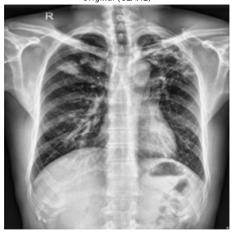
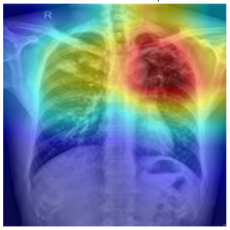
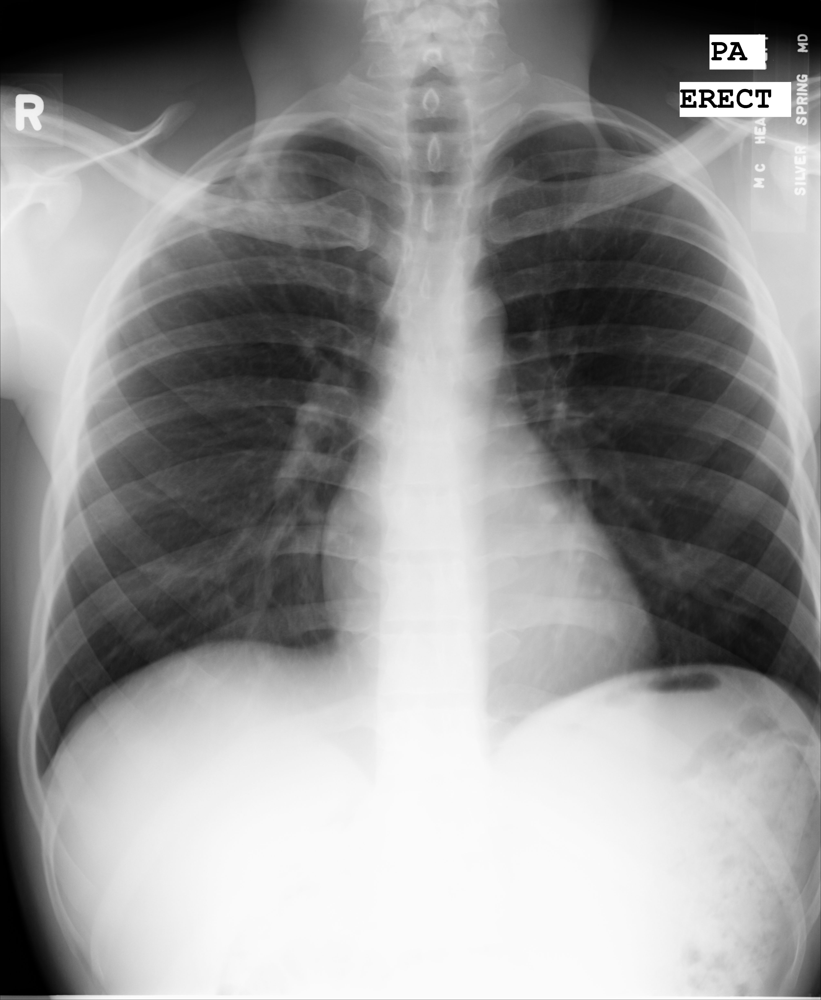
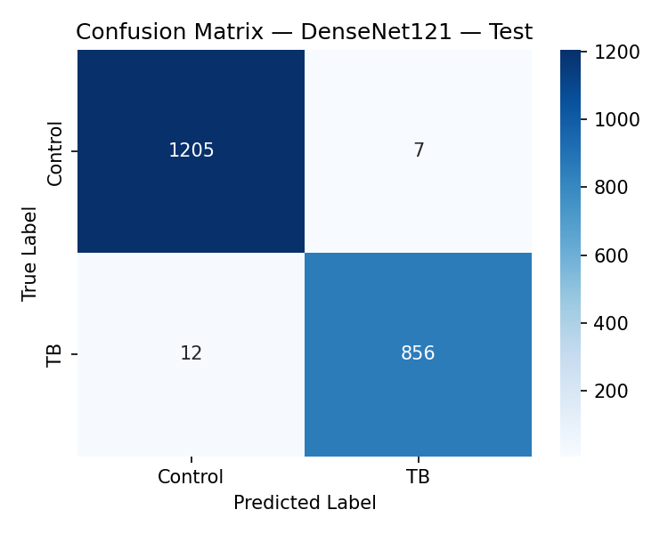
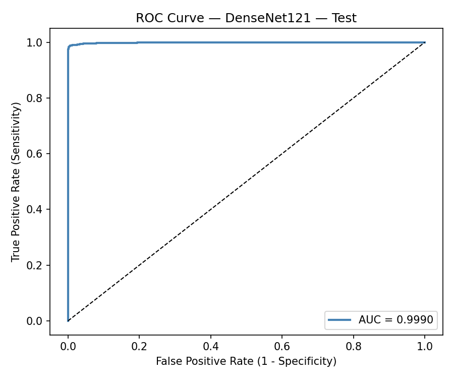
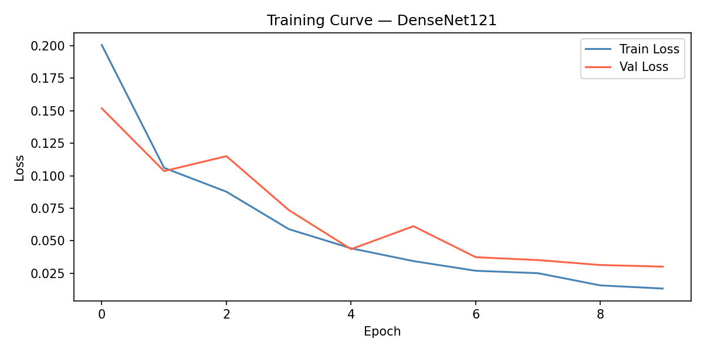
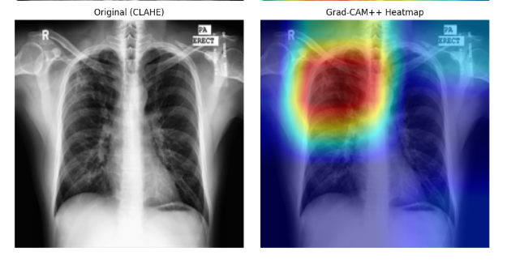
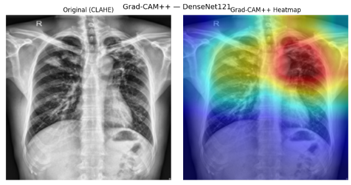

# explainable-tuberculosis-detection
An AI-powered tuberculosis detection system using DenseNet121 and chest X-ray images. The model classifies X-rays as Tuberculosis or Normal, provides prediction confidence scores, and generates Grad-CAM++ heatmaps for explainable AI-assisted diagnosis and clinical decision support.
# Tuberculosis Classification from Chest X-Ray Images

Deep learning system that classifies chest X-ray images as **Tuberculosis-positive** or **Control (Normal)**, using a fine-tuned DenseNet121 with CLAHE preprocessing and Grad-CAM++ explainability, developed as part of an MSc thesis under the DATICAN Data Science Scholarship (NIH-funded DS-I Africa Initiative).

<p align="center">
  
  
</p>

## Table of Contents
- [Overview](#overview)
- [Model Selection](#model-selection)
- [Dataset](#dataset)
- [Model Architecture](#model-architecture)
- [Results](#results)
- [Explainability (Grad-CAM++)](#explainability-grad-cam)
- [Setup & Installation](#setup--installation)
- [Usage](#usage)
- [Live Demo](#live-demo)
- [Project Structure](#project-structure)
- [Limitations & Future Work](#limitations--future-work)

## Overview

Tuberculosis (TB) remains a major global health burden, and manual review of chest X-rays (CXR) for TB screening is time-consuming and dependent on radiologist availability. This project presents a comparative analysis of deep learning models for automated TB detection from CXR images, aggregating five public datasets into a unified pipeline and applying Grad-CAM++ to visualize the regions driving each prediction — supporting clinical trust and interpretability.

## Model Selection

As part of the underlying thesis research, **three CNN architectures — EfficientNet-B0, DenseNet121, and ResNet50 — were trained and benchmarked under a unified experimental framework** (identical preprocessing, splits, and training configuration) to identify the strongest performer for this task.

**DenseNet121 was confirmed as the best-performing model** across accuracy, sensitivity, specificity, and F1-score. Based on that outcome, this notebook was built specifically around the finalized DenseNet121 pipeline — it does not include the EfficientNet-B0 or ResNet50 training code, only the winning configuration.

Comparative results from the model-selection notebook (same test set, 2,080 images):

| Model | Accuracy | Sensitivity | Specificity | F1-Score | AUC-ROC |
|---|---|---|---|---|---|
| EfficientNet-B0 | 98.61% | 97.93% | 99.09% | 98.32% | 0.9987 |
| ResNet50 | 98.65% | 98.50% | 98.76% | 98.39% | 0.9989 |
| **DenseNet121** | **99.04%** | **98.62%** | **99.34%** | **98.85%** | 0.9987 |

DenseNet121 led on accuracy, specificity, and F1-score, and was competitive on sensitivity — making it the clear choice to carry forward into the finalized single-model pipeline in this notebook.

https://www.kaggle.com/code/adekoyaoluwatobi/comparative-analysis-of-tb-classification 

## Dataset

- **Total samples:** 10,398 chest X-ray images
- **Class distribution:** 6,057 Control (Normal) | 4,341 Tuberculosis
- **Sources (5 public datasets, unified into a single pipeline):**
  | Dataset | Role |
  |---|---|
  | Montgomery County CXR Set | Training/validation/test pool |
  | Shenzhen Hospital CXR Set | Training/validation/test pool |
  | TBX11K | Training/validation/test pool |
  | TB Chest X-ray (Rahman) | Training/validation/test pool |
  | Pakistan TB CXR Dataset | External validation cohort |
- **Split:** Stratified 70% train / 10% validation / 20% test (7,278 / 1,040 / 2,080 images)
- **Preprocessing:**
  - CLAHE (Contrast Limited Adaptive Histogram Equalization) applied to every image (clip limit 2.0, tile grid 8×8) to enhance visibility of subtle lung opacities
  - Resize to 224×224, normalization using ImageNet mean/std
- **Augmentation (train only):** random horizontal flip, random rotation (±10°), color jitter (brightness/contrast ±0.2), random affine translation (±5%)
- **Class imbalance handling:** weighted random sampling + class-weighted Cross-Entropy Loss

### Sample Chest X-ray Images

<p align="center">
  
  
</p>

## Model Architecture

| Component | Detail |
|---|---|
| Backbone | DenseNet121 (ImageNet-pretrained) |
| Head | `AdaptiveAvgPool2d(1)` → `Dropout(0.4)` → `Linear(1024 → 2)` |
| Loss function | Class-weighted Cross-Entropy Loss |
| Optimizer | Adam, lr = 1e-4 |
| LR schedule | Cosine Annealing (`eta_min=1e-6`) |
| Epochs | 10 (early stopping, patience = 3, best checkpoint saved on validation loss) |
| Batch size | 16 |
| Explainability | Grad-CAM++ (`GradCAMPlusPlus`), targeting the final dense block (`denseblock4`) |
| Hardware | Kaggle GPU |


## Results

**Reported/canonical figures**

| Metric | Score |
|---|---|
| **Accuracy** | **99.04%** |
| **Sensitivity (Recall)** | **98.62%** |
| **Specificity** | **99.34%** |
| **F1-Score** | **98.85%** |
| **AUC-ROC** | **0.9987** |

**This notebook's run** (a standalone retraining of the finalized DenseNet121 pipeline) produced closely matching but not identical results on the same 2,080-image test set:

| Metric | Score |
|---|---|
| Accuracy | 99.09% |
| Sensitivity (Recall) | 98.62% |
| Specificity | 99.42% |
| F1-Score | 98.90% |
| AUC-ROC | 0.9990 |

Per-class performance for this run (from the classification report):

| Class | Precision | Recall | F1-Score | Support |
|---|---|---|---|---|
| Control | 0.99 | 0.99 | 0.99 | 1,212 |
| TB | 0.99 | 0.99 | 0.99 | 868 |

The small gap between the two runs (±0.05–0.08 points) is expected from run-to-run variance — random weight initialization, sampler shuffling, and augmentation randomness. It is not a meaningful performance difference. The model trained smoothly over 10 epochs with the early-stopping checkpoint (best validation loss) saved automatically; validation accuracy progressed from 95.10% (epoch 1) to 99.13% by the final epoch.

### Confusion Matrix



### ROC Curve



### Training and Validation Loss



## Explainability (Grad-CAM++)

To support clinical interpretability, Grad-CAM++ heatmaps are generated for TB-positive test images, highlighting the lung regions the model relied on most heavily for its prediction. This helps verify that the model is attending to clinically relevant areas (e.g. lung opacities) rather than spurious background features.

### Grad-CAM++ Visualizations

<p align="center">
  
  
</p>

## Setup & Installation

### Prerequisites
- Python 3.9+
- CUDA-capable GPU (recommended)

### 1. Clone the repository
```bash
git clone https://github.com/adekoya759/explainable-tuberculosis-detection
cd explainable-tuberculosis-detection
```

### 2. Create a virtual environment and install dependencies
```bash
python -m venv venv
source venv/bin/activate      # On Windows: venv\Scripts\activate

pip install torch torchvision opencv-python pillow numpy scikit-learn matplotlib tqdm grad-cam
```

### 3. Download the datasets
Download the five source datasets (Montgomery, Shenzhen, TBX11K, TB Chest X-ray Rahman, Pakistan) and place them under a `Datasets/` https://www.kaggle.com/datasets/adekoyaoluwatobi/ct-image-dataset-for-tuberculosis-detection folder matching the structure expected in the notebook:
```
Datasets/
├── TB_Chest_X-ray_Rahman/
├── TBX11K/imgs/
├── Pakistan/
├── MontgomerySet/
└── Shenzhen/
```
Update the `base_path` variable in the notebook to point to your local copy.

## Usage

1. Open `tuberculosis-classification.ipynb` https://www.kaggle.com/code/adekoyaoluwatobi/tuberculosis-classification in Jupyter Notebook, JupyterLab, Kaggle, or Google Colab.
2. Run all cells sequentially to:
   - Aggregate and preprocess all five datasets (CLAHE + augmentation)
   - Perform the stratified 70/10/20 split
   - Train DenseNet121 with class-weighted loss and early stopping
   - Evaluate on the held-out test set (accuracy, sensitivity, specificity, F1, AUC-ROC)
   - Generate Grad-CAM++ visualizations for TB-positive predictions
3. The best checkpoint is saved automatically as:
   - `best_DenseNet121.pth`


## Live Demo

https://explainable-tuberculosis-detection.streamlit.app/ 

## Project Structure

```
tuberculosis-classification/
├── tuberculosis-classification.ipynb   # Main notebook: data pipeline, training, evaluation, Grad-CAM++
├── best_DenseNet121.pth                # Saved best checkpoint (generated after training)
├── Datasets/                           # Source CXR datasets (not included — see Setup)
└── README.md
```

## Limitations & Future Work

- This notebook reflects only the final, winning DenseNet121 configuration. 
- The Pakistan cohort was used as part of the pooled train/val/test split rather than as a fully independent external validation set in this notebook.
- Grad-CAM++ visualizations are currently qualitative.
- No multi-class distinction (e.g. TB severity or subtype) is made — the model is binary (TB vs. Control).

---

## 👨‍💻 Author

**Oluwatobi Adekoya**

- 🌐 Portfolio: https://dantechonline.com.ng

